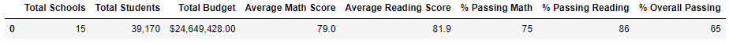
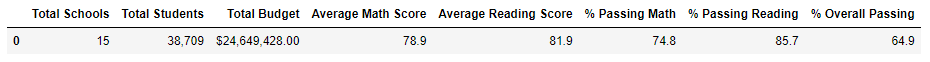
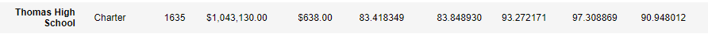
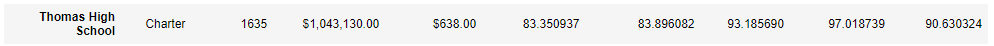

# School_District_Analysis

## Project Overview

A school board requested to review the School District Analyses because there was evidences of academic dishonesty; specifically, reading and math grades for 
Thomas High School ninth graders appear to have been altered. In order to avoid any possible skews in the analysis, the Math and Reading grades for the 9th grade
Thomas High School students were excluded.

Analysis key deliverables:
1-The district summary DataFrame
2-The school summary DataFrame
3-The top 5 performing schools, based on the overall passing rate
4-The bottom 5 performing schools, based on the overall passing rate
5-The average math score for each grade level from each school
6-The average reading score for each grade level from each school
7-The scores by school spending per student
8-The scores by school size
9-The scores by school type

This project was fully developed in Python using Pandas and Numpy, code can be checked at the following link:

[PyCitySchools_Challenge.ipynb](PyCitySchools_Challenge.ipynb)

## Resources

[school_complete.csv](Resources/schools_complete.csv)

[students_complete.csv](Resources/students_complete.csv)

## Results

**How is the district summary affected?

The district summary was mostly affected in the Total Students amount, that decreased by 461, from 39,170 to 38,709. The avarage Math and Reading scores and the 
passing percentages do not present relevant differences.

Before

After

**How is the school summary affected?

Since the changes were made exclusively in the Thomas High School, this is the only school that was affected. We can identify small changes on the average scores and passing percentages.

Before

After

**How does replacing the ninth graders’ math and reading scores affect Thomas High School’s performance relative to the other schools?

It is possible to identify small changes on the average scores and passing percentages for the Thomas High School, while other schools were not affected.

**How does replacing the ninth-grade scores affect the following:

- Math and reading scores by grade
It only impacted the 9th grades scores, that are 'Nan' in the review.

- Scores by school spending
The only spending range affectes was the $631-645, which is the Thomas High School range. While the Average Math Score had a slightly decrease, the Average Reading
Score saw a small increase. The passing percentages all decreased. 

- Scores by school size
Aligned with the summary by spending, the only tier that changes was the one THS is in (Medium 1000-1999), and there was a drecrease overall apart form the Average
Reading Score, that saw a slightly increase.

- Scores by school type
THS type, Charter, was impacted, presenting a decrease overall but in the Average Reading Score. 

## Summary

Summarize four changes in the updated school district analysis after reading and math scores for the ninth grade at Thomas High School have been replaced with NaNs.

**Students decreased by 461, from 39,170 to 38,709.
**Spending Ranges (Per Student) - $631-645 - % Overall Passing from 62.857656 to 62.778233
**School Size - Medium (1000-1999) - % Overall Passing from 90.621535 to 90.557997
**The Average Reading Score is the only KPI that increased when we executed the review
